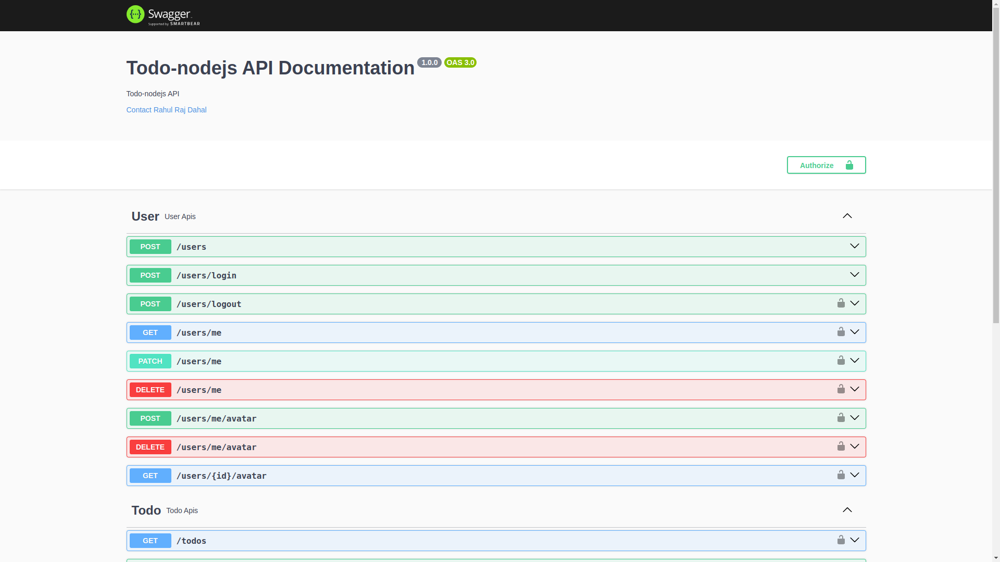

# [Todo-Nodejs](https://github.com/rahulrajdahal/todo-nodejs). APIs for a todo app

Create tasks and complete them!

- Register as a new user
- Create, Update and complete tasks.

## Preview

[](https://github.com/rahulrajdahal/todo-nodejs)

## 🏗 Development Guide

### 1. clone the repository

```sh
git clone https://github.com/rahulrajdahal/todo-nodejs.git
```

### 2. Install Dependencies

#### npm

```sh
cd todo-nodejs && npm install
```

### 3. Connect to your API 💾

- Create **.env** file
- Copy **.env.example** file contents to **.env**
- Update the environment variables

### 4. Run development server

```sh
npm run dev
```

#### OR

### Run Production server

```sh
npm run start
```

## 🚀 Project Structure

Inside of project [Todo-Nodejs](https://github.com/rahulrajdahal/todo-nodejs), you'll see the following folders and files:

```text
/
├── src/
|   ├── db/
│   │   └── mongoose.js
|   ├── middleware/
│   │   └── auth.js
|   ├── models/
│   │   │── user.js
│   │   └── todo.js
|   ├── routers/
│   │   │── user.js
│   │   └── todo.js
├── app.js
├── index.js
├── swagger.js
├── .env.example
├── README.md
└── package.json
```

## 🧞 Commands

All commands are run from the root of the project, from a terminal:

| Command         | Action                                       |
| :-------------- | :------------------------------------------- |
| `npm install`   | Installs dependencies.                       |
| `npm run dev`   | Starts local dev server at `localhost:PORT`. |
| `npm run start` | Start the production server.                 |
